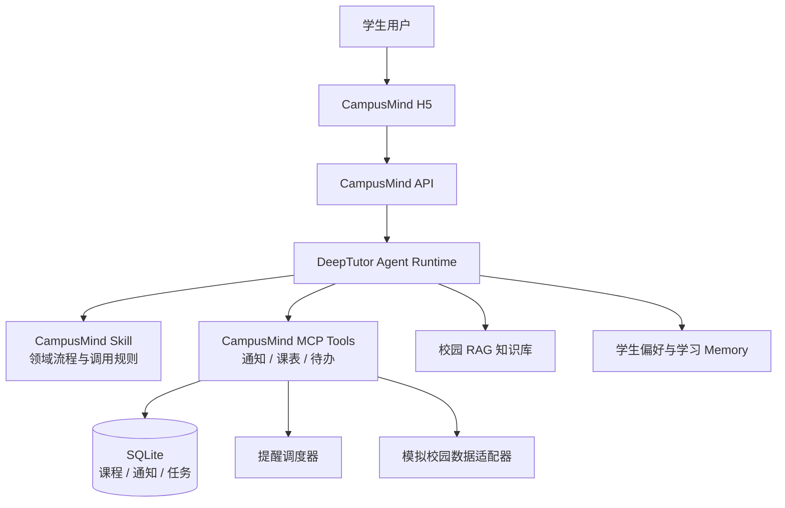

<div align="center">

# CampusMind AI

### 基于 Agent 的私人校园智能体

让 AI 不只回答校园问题，还能理解通知、整理事务、生成待办并主动提醒。

[](#项目状态)
[](https://github.com/HKUDS/DeepTutor)
[](#计划技术栈)

**Meoo 想天开 · AI 互动应用赛道参赛项目**

</div>

---

## 项目简介

高校里的课程、通知、报名、考试和活动信息通常分散在教务系统、学院网站、公众号与班级群中。学生不仅需要反复查找，还需要自己判断重点、记录截止时间并安排后续行动。

CampusMind AI 希望把这些零散信息变成一个可以执行的校园事务流：

```text
校园信息 → Agent 理解 → 结构化事项 → 待办与日程 → 主动提醒
```

项目基于开源 [DeepTutor](https://github.com/HKUDS/DeepTutor) 的 Agent、Tool、RAG 和 Memory 能力扩展校园领域功能。CampusMind 不重写 DeepTutor 核心，而是通过独立 Skill、MCP Tool 和校园数据层完成二次开发。

> CampusMind AI 不是另一个只会聊天的校园问答机器人，而是一个能够理解校园环境、记住学生特点并协助完成事务的校园智能体。

## 核心体验

### 1. 今日校园简报

用户询问“今天有什么事情？”，Agent 会汇总当天课程、临期待办、重要通知和风险提醒，而不是只返回一段泛化建议。

### 2. 通知转行动

系统将长篇校园通知解析为可执行事项：

```text
四六级报名通知
├─ 适用对象：2026 级本科生
├─ 截止时间：9 月 15 日 18:00
├─ 重要程度：高
├─ 下一步：登录教务系统完成报名
└─ 自动生成：报名待办 + 截止提醒
```

### 3. 课表与空闲时间

结合课程时间、地点和已有任务，回答“下一节课在哪里”“今晚有没有空”“什么时候适合完成实验报告”等问题。

### 4. 校园知识问答

通过校园规章、办事流程和通知文件构建 RAG 知识库，为答案提供可追溯依据。

### 5. 个性化主动提醒

依据年级、专业、课程和学习习惯调整提醒内容，例如在考试前生成阶段性复习建议，而不是发送固定模板。

## 系统架构



### 职责边界

| 模块 | 负责内容 | 不负责内容 |
| --- | --- | --- |
| CampusMind Skill | 告诉 Agent 何时、按什么流程处理校园事务 | 不直接保存任务或执行提醒 |
| MCP Tools | 通知解析、课程查询、待办创建与状态更新 | 不替代 Agent 的意图判断 |
| SQLite | 保存课程、通知、任务和准确截止时间 | 不保存模糊的长期偏好 |
| DeepTutor RAG | 检索规章、流程与通知原文 | 不充当事务数据库 |
| DeepTutor Memory | 保存专业、兴趣、习惯等个性化信息 | 不作为课表和截止时间的唯一来源 |
| Scheduler | 在确定时间触发提醒 | 不依赖用户主动发起聊天 |

## MVP 范围

首个可运行版本只验证一条完整链路：

```text
模拟校园通知与课表
        ↓
Agent 调用 CampusMind Tool
        ↓
生成结构化任务并写入 SQLite
        ↓
H5 展示今日简报
        ↓
触发临期提醒
```

MVP 包含：

- 模拟校园通知、课表和学生档案
- 通知关键信息提取与字段校验
- 今日课程查询与空闲时间计算
- 待办创建、完成和优先级排序
- 校园资料 RAG 问答
- 本地定时提醒
- 面向演示的响应式 H5 页面

MVP 暂不包含：

- 真实教务系统账号登录或自动操作
- 对所有高校系统的通用适配
- 小程序正式上架与消息审核流程
- 未经用户授权采集班级群或私人数据

## 计划技术栈

| 层级 | 技术选型 |
| --- | --- |
| Agent 运行时 | DeepTutor |
| 后端 | Python 3.12、FastAPI、Pydantic |
| Agent 扩展 | DeepTutor Skill、MCP Tools |
| 数据 | SQLite、模拟校园数据适配器 |
| 知识库 | DeepTutor RAG |
| 前端 | React、Vite、TypeScript |
| 测试 | Pytest、前端单元测试、浏览器流程测试 |

具体依赖将在首个可运行里程碑中锁定，README 不提前声明尚未验证的版本兼容性。

## 计划目录

> 以下为拟建结构，当前仓库尚处于项目初始化阶段。

```text
CampusMind-AI/
├─ apps/
│  ├─ api/                    # FastAPI 服务入口
│  └─ web/                    # CampusMind H5
├─ campusmind/
│  ├─ domain/                 # Notice、Course、Task 等领域模型
│  ├─ tools/                  # DeepTutor / MCP 工具
│  ├─ services/               # 通知、课表、待办、提醒服务
│  └─ storage/                # SQLite 仓储实现
├─ skills/
│  └─ campusmind/SKILL.md     # Agent 校园工作流
├─ data/demo/                 # 可公开的模拟演示数据
├─ tests/                     # 单元与集成测试
├─ docs/                      # 架构、演示和答辩材料
└─ README.md
```

## 8 天 Demo 路线

| 阶段 | 目标 | 完成标准 |
| --- | --- | --- |
| Day 1 | 项目骨架与 DeepTutor 连通 | Agent 能调用一个 CampusMind Tool |
| Day 2 | 校园数据与知识库 | 模拟资料可被检索并返回来源 |
| Day 3 | 通知解析 | 通知可稳定转换为结构化事项 |
| Day 4 | 课表能力 | 能查询今日课程并计算空闲时间 |
| Day 5 | 待办闭环 | 任务可创建、排序、完成和持久化 |
| Day 6 | Memory 与主动提醒 | 个性化信息生效，临期任务能触发提醒 |
| Day 7 | H5 整合 | 三个核心演示场景可在页面完成 |
| Day 8 | 演示交付 | 测试通过，视频、PPT 和答辩流程齐备 |

## 项目状态

当前状态：**MVP 建设前的架构与需求整理阶段**。

- [x] 明确产品定位与核心场景
- [x] 确认基于 DeepTutor 扩展而非重写核心
- [x] 明确 Skill、Tool、RAG、Memory 与结构化数据的边界
- [ ] 建立可运行的后端和测试基线
- [ ] 完成“今日校园简报”纵向链路
- [ ] 完成 H5 与主动提醒 Demo

在代码真正落地并通过验证前，本 README 中的功能均视为设计目标，不代表已经交付。

## 协作约定

- `main` 保持可演示、可运行。
- 功能开发使用独立分支并通过 Pull Request 合入。
- 新能力优先以 CampusMind 模块或 Tool 形式实现，不直接修改 DeepTutor 核心。
- 每个核心 Tool 至少包含正常路径、无数据路径和异常输入测试。
- 演示数据不得包含真实学生隐私或校园账号凭据。

## 上游项目与许可

CampusMind AI 使用 [HKUDS/DeepTutor](https://github.com/HKUDS/DeepTutor) 作为上游技术基础。DeepTutor 采用 Apache License 2.0，使用和分发时应保留相应版权及许可声明。

CampusMind AI 自身的仓库许可将在首个可运行版本发布前确认并补充；仓库内第三方组件分别遵循其原始许可。

---

<div align="center">

**CampusMind AI — 让校园信息被理解，让学生事务被完成。**

</div>
