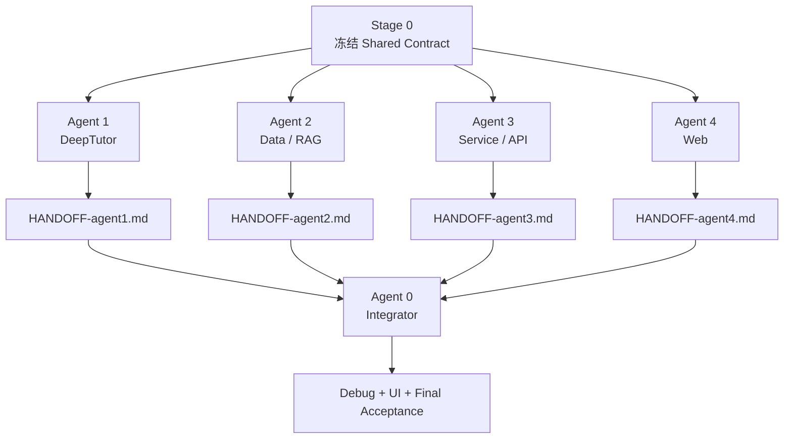

<div align="center">

# CampusMind AI

### 基于 Agent 的私人校园智能体

让 AI 理解校园通知、整理课程与任务，并在正确的时间主动提醒学生。

[](#当前状态)
[](https://github.com/HKUDS/DeepTutor)
[](contracts/SHARED_CONTRACT.md)

**Meoo 想天开 · AI 互动应用赛道参赛项目**

</div>

---

## 项目目标

CampusMind AI 基于 [DeepTutor](https://github.com/HKUDS/DeepTutor) 扩展校园领域能力，不重写其核心。MVP 必须真实跑通：

1. “今天有什么事情？” → Agent → Tool → Service → SQLite → H5。
2. 校园通知 → 字段提取 → 用户确认 → 创建任务 → 主动提醒。
3. 校园问题 → RAG 检索 → 返回答案与资料来源。
4. 临期任务 → 触发提醒 → 完成任务后停止提醒。

所有功能在通过测试前都视为设计目标，不代表已经交付。

## 先读这里

本仓库按 **5 名成员 + 5 个 AI 搭档** 组织：4 名组员分别与 AI 组成 Agent 1–4，1 名组长与主 AI 组成 Agent 0。每个编号表示一个“成员 + AI”的人机施工搭档，而不是让 AI 脱离成员单独决定。成员负责确认范围、检查输出、运行验收和提交分支；AI 负责持续施工、自检和生成 HANDOFF。所有搭档遵守同一套目录、分支、测试和交接规则。不要让 Agent 0 与 Agent 1–4 同时修改代码。

| 身份 | 必读文件 | 只执行 |
| --- | --- | --- |
| 所有 Agent | 本 README + [Shared Contract](contracts/SHARED_CONTRACT.md) | 全局契约与禁止事项 |
| 组员 + AI（Agent 1） | [AGENT-1.md](docs/agents/AGENT-1.md) | DeepTutor / Skill / MCP / Runtime |
| 组员 + AI（Agent 2） | [AGENT-2.md](docs/agents/AGENT-2.md) | Data / SQLite / RAG |
| 组员 + AI（Agent 3） | [AGENT-3.md](docs/agents/AGENT-3.md) | Campus Service / FastAPI |
| 组员 + AI（Agent 4） | [AGENT-4.md](docs/agents/AGENT-4.md) | React / Vite / H5 |
| 组长 + 主 AI（Agent 0） | [AGENT-0.md](docs/agents/AGENT-0.md) + 四份 HANDOFF | 合并、Debug、UI 改进与发布 |

每个子 Agent 完成后，必须按 [HANDOFF 模板](docs/HANDOFF_TEMPLATE.md) 创建自己的交接文件。最终结果按 [FINAL ACCEPTANCE](docs/FINAL_ACCEPTANCE.md) 验收。

## 执行顺序



- **Day 0：** 人或主 Agent 冻结契约和项目骨架，之后不参与并行施工。
- **Day 1–4：** 4 名组员分别与 AI 在独立分支或 worktree 中完成 Agent 1–4 模块。
- **Day 4 18:00：** 功能冻结，四个子 Agent 提交 HANDOFF 后停止。
- **Day 5–8：** 组长与主 AI 组成 Agent 0，单独整合、修 Bug、改进 UI、执行最终验收和发布。

## 不可违反的规则

详细规则见 [Shared Contract](contracts/SHARED_CONTRACT.md)，这里保留最关键部分：

- Python `3.12`；后端 FastAPI + Pydantic；数据库 SQLite；前端 React + Vite + TypeScript。
- 时区固定为 `Asia/Shanghai`，时间使用带时区的 ISO 8601。
- 公共模型为 `Notice`、`Course`、`Task`、`StudentProfile`、`Reminder`。
- 子 Agent 只能修改自己 `Owns` 的目录。
- 缺少其他模块时使用 Shared Contract 中的 Stub/Mock，不得越界代写。
- 禁止自行修改公共字段、API、错误码或技术栈。
- 禁止提交真实个人数据、校园账号、密码和 API Key。
- 不允许以“框架已建立”“主体完成”“接下来可以”为结束理由。
- 必须实际运行验收命令，测试通过并创建 HANDOFF 后才能停止。

## 角色与唯一交付

| Agent | Owns | 最终交付 |
| --- | --- | --- |
| Agent 1 | `skills/`、`campusmind/tools/`、`campusmind/integrations/` | 能真实调用校园 Tool 的 DeepTutor Agent |
| Agent 2 | `campusmind/domain/`、`storage/`、`repositories/`、`data/` | 数据模型、SQLite、演示数据和 RAG |
| Agent 3 | `campusmind/services/`、`apps/api/` | 校园业务逻辑和 FastAPI 接口 |
| Agent 4 | `apps/web/` | 完整 H5，先 Mock、后接固定 API |
| Agent 0 | 全项目集成层 | 可启动、可测试、可演示的 CampusMind |

## 计划目录

```text
CampusMind-AI/
├─ README.md
├─ contracts/
│  └─ SHARED_CONTRACT.md
├─ docs/
│  ├─ agents/
│  │  ├─ AGENT-0.md
│  │  ├─ AGENT-1.md
│  │  ├─ AGENT-2.md
│  │  ├─ AGENT-3.md
│  │  └─ AGENT-4.md
│  ├─ HANDOFF_TEMPLATE.md
│  └─ FINAL_ACCEPTANCE.md
├─ apps/
│  ├─ api/
│  └─ web/
├─ campusmind/
│  ├─ domain/
│  ├─ integrations/
│  ├─ repositories/
│  ├─ services/
│  ├─ storage/
│  └─ tools/
├─ skills/campusmind/
├─ data/demo/
├─ data/knowledge/
└─ tests/
```

## 分支与远程仓库

每个 Agent 使用独立分支和独立 worktree/克隆：

```text
agent/1-runtime
agent/2-data-rag
agent/3-service-api
agent/4-web
agent/0-integration
```

如果使用独立施工仓库：

- `origin` 指向 Agent 施工仓库。
- `target` 指向最终目标仓库 `yee01001100/CampusMind-AI`。
- 子 Agent 只推送到 `origin` 的各自分支。
- Agent 0 从四个分支合并后，将 `agent/0-integration` 推到 `target`。
- 独立且无 fork 关系的仓库不能直接向目标仓库发跨仓 PR；需要目标仓库推送权限，或使用同一 fork 网络。

Git 操作和 PR 约束以 [Shared Contract](contracts/SHARED_CONTRACT.md#git-与分支契约) 为准。

## Agent 启动 Prompt

子 Agent 只替换编号：

> 阅读 `README.md`、`contracts/SHARED_CONTRACT.md` 和 `docs/agents/AGENT-N.md`。你是 Agent N。严格只执行该执行包，持续工作直到验收命令通过，创建 `HANDOFF-agentN.md` 后停止。不得修改其他 Agent 的目录。

主 Agent：

> 阅读 `README.md`、`contracts/SHARED_CONTRACT.md`、`docs/agents/AGENT-0.md` 和四份 HANDOFF。你是 Agent 0。按规定顺序合并四块实现，持续完成 Debug、UI 改进和最终验收，直到项目真实可运行。

## 当前状态

- [x] 明确产品目标和 MVP 场景
- [x] 明确 4 个子 Agent + 1 个主 Agent 的执行方式
- [x] 拆分 README、Shared Contract、Agent Packets、HANDOFF 和最终验收
- [ ] 创建 Day 0 项目骨架和可执行契约测试
- [ ] Agent 1–4 并行施工
- [ ] Agent 0 集成、Debug 和 UI 改进
- [ ] 最终发布

## 上游与许可

CampusMind AI 使用 [HKUDS/DeepTutor](https://github.com/HKUDS/DeepTutor) 作为技术基础。DeepTutor 采用 Apache License 2.0。CampusMind AI 自身许可将在首个可运行版本前确认；第三方组件遵循各自原始许可。

---

<div align="center">

**让校园信息被理解，让学生事务被完成。**

</div>
