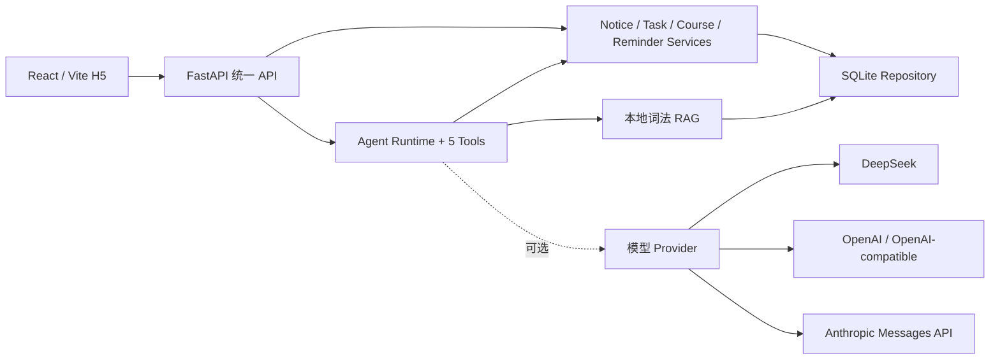

<div align="center">

# CampusMind AI

### 基于 Agent 的本地校园智能事务助手

把校园通知变成待办，统一查看课表与提醒，并用带来源的本地资料回答校园问题。

[](#当前状态)
[](pyproject.toml)
[](apps/web)
[](contracts/SHARED_CONTRACT.md)

**Meoo 想天开 · AI 互动应用赛道参赛项目**

</div>

---

## 当前状态

`agent/0-integration` 已完成四个子模块的合并和主 Agent 联调。当前版本可以在一台 Windows 电脑上运行完整 MVP：

- 今日简报：Agent 调用真实 Tool，经 Service 从 SQLite 读取课表、任务和通知。
- 通知转任务：解析通知、标记不确定字段、人工确认、创建任务并去重。
- 校园资料问答：本地 RAG 检索，答案显示资料标题、日期和来源；无可靠来源时拒绝编造。
- 提醒闭环：按任务类型生成提醒，完成或取消任务后停止提醒，恢复任务时恢复未来提醒。
- H5：React + Vite，支持 `375 × 812`、`1366 × 768`、`1440 × 900`。
- 开发模式：默认不需要模型 Key，使用可验证的 `local-rules` Runtime。

演示数据全部标记为“模拟”，不连接真实教务系统，也不读取校园账号、Cookie 或密码。

## 五人如何协作

本项目按 **5 名成员 + 5 个 AI 搭档** 组织。四名组员各自与 AI 承担一个子 Agent，一名组长与主 AI 承担 Agent 0。成员负责确认范围、复核、验收和提交；AI 负责在约束内施工、自测和生成 HANDOFF。

| 人机搭档 | 负责范围 | 分支 | 状态 |
| --- | --- | --- | --- |
| Agent 1 | Runtime、Tool、DeepTutor/多模型 Provider 适配 | `agent/1-runtime` | 完成 |
| Agent 2 | Domain、SQLite、演示数据、RAG | `agent/2-data-rag` | 完成 |
| Agent 3 | Service、FastAPI、错误响应 | `agent/3-service-api` | 完成 |
| Agent 4 | React/Vite H5、Mock、响应式与浏览器 QA | `agent/4-web` | 完成 |
| Agent 0 | 合并、真实联调、Debug、UI 和发布验收 | `agent/0-integration` | 完成 |

每个角色的详细要求在 [`docs/agents`](docs/agents)，四份实际交接在仓库根目录的 `HANDOFF-agent1.md` 到 `HANDOFF-agent4.md`。完整集成证据见 [`docs/INTEGRATION_REPORT.md`](docs/INTEGRATION_REPORT.md)。

## 架构



正式集成入口是 `apps.api.integration:app`。`apps.api.main:app` 只用于 Agent 3 的可替换内存仓库切片，不代表完整项目。

## Windows 快速启动

### 1. 准备环境

- Git
- Python `3.12.x`（不支持 3.13/3.14）
- Node.js `20+`
- Microsoft Edge（浏览器 QA 使用；日常运行可使用其他现代浏览器）

克隆个人仓库的集成分支：

```powershell
git clone --branch agent/0-integration https://github.com/guiyuanzhuomin-oss/CampusMind-AI-Agents.git
Set-Location CampusMind-AI-Agents
```

创建 Python 环境并安装后端与测试依赖：

```powershell
py -3.12 -m venv .venv
.\.venv\Scripts\python.exe -m pip install --upgrade pip
.\.venv\Scripts\python.exe -m pip install -e ".[dev]"
Copy-Item .env.example .env
```

`.env` 已被 Git 忽略。默认 `CAMPUSMIND_MODEL_MODE=local-rules`，即使系统环境意外残留 Key 也不会自动进入在线模型；完整数据流仍可运行。

### 2. 启动后端

在仓库根目录开第一个 PowerShell：

```powershell
.\.venv\Scripts\python.exe -m uvicorn apps.api.integration:app --env-file .env --host 127.0.0.1 --port 8000
```

启动时会幂等创建 `data/local/campusmind.db`，导入 `data/demo` 和 `data/knowledge`。健康检查：<http://127.0.0.1:8000/api/health>。

### 3. 启动前端

在仓库根目录开第二个 PowerShell：

```powershell
Copy-Item apps\web\.env.example apps\web\.env.local -Force
Set-Location apps\web
npm ci
npm run dev
```

打开 <http://127.0.0.1:5173>。`apps/web/.env.example` 默认设置 `VITE_USE_MOCKS=false`，因此页面连接真实集成 API。若只想独立演示前端，把它改成 `true`。

## 可选模型配置

项目不要求模型 Key 才能启动，默认且推荐的演示模式是 `CAMPUSMIND_MODEL_MODE=local-rules`。系统不会根据环境里偶然存在的 Key 自动推断 Provider；只有显式选择模式并提供该模式所需配置时，才会启用在线模型。缺少对应 Key、模型名或必要 URL 时，启动会直接给出明确错误。

Day 0 安全规则禁止凭据变量名出现在可提交的 `.env.example`，所以下列配置只能写进已被 Git 忽略的本机根目录 `.env`。四种在线模式任选一种，不要混用。

### DeepSeek

```dotenv
CAMPUSMIND_MODEL_MODE=deepseek
DEEPSEEK_API_KEY=<新生成且未泄露的 Key>
DEEPSEEK_BASE_URL=https://api.deepseek.com
DEEPSEEK_MODEL=deepseek-chat
```

### OpenAI 标准 API

```dotenv
CAMPUSMIND_MODEL_MODE=openai
OPENAI_API_KEY=<本机 Key>
OPENAI_BASE_URL=https://api.openai.com/v1
OPENAI_MODEL=<账户实际可用的模型名>
```

### 通用 OpenAI-compatible 网关

```dotenv
CAMPUSMIND_MODEL_MODE=openai-compatible
MODEL_API_KEY=<网关 Key>
MODEL_BASE_URL=https://provider.example/v1
MODEL_NAME=<网关支持的模型名>
```

该模式调用 OpenAI Chat Completions 协议，并要求响应正文位于字符串字段 `choices[0].message.content`。如果服务商只支持 Responses API、自定义流式事件或非字符串多模态内容，需要另写适配器。

### Anthropic 原生 API

```dotenv
CAMPUSMIND_MODEL_MODE=anthropic
ANTHROPIC_API_KEY=<本机 Key>
ANTHROPIC_BASE_URL=https://api.anthropic.com/v1
ANTHROPIC_MODEL=<账户实际可用的 Claude 模型名>
ANTHROPIC_VERSION=2023-06-01
ANTHROPIC_MAX_TOKENS=1024
```

Anthropic 模式使用原生 Messages API：`system` 消息会提升到请求顶层，响应只拼接 `content` 中的文本块，不暴露 thinking 块。

所有 `BASE_URL` 都必须填写 API 根路径：OpenAI 示例到 `/v1`，Anthropic 示例到 `/v1`，不要再附加 `/chat/completions` 或 `/messages`。Key 必须和对应服务商的 Base URL 配套；不要把 Key 放入 `VITE_*`，因为 Vite 会把变量暴露给浏览器。任何曾发到聊天、截图、Issue 或提交记录里的 Key 都应立即撤销并轮换。

本轮四类 Provider 均通过 Fake Transport 验证请求格式、认证头、响应解析、超时和错误处理，没有使用真实 Key 做在线调用。

## 演示流程

1. 在“今日简报”查看 SQLite 中的课程、任务、通知和建议。
2. 在“通知解析”粘贴带明确年份的模拟通知。
3. 核对不确定字段，勾选确认，创建任务。
4. 在“课表与待办”确认任务已持久化，尝试完成和恢复。
5. 在“问问 Agent”输入“学校规定考试管理是什么？”，检查回答和“资料来源”。
6. 输入资料库没有覆盖的问题，系统应返回 `RAG_NO_SOURCE`，不能编造学校规定。

## 测试与验收

后端、数据、RAG、Runtime 和集成测试：

```powershell
.\.venv\Scripts\python.exe -m pytest -q
.\.venv\Scripts\python.exe scripts\check_day0.py
.\.venv\Scripts\python.exe scripts\check_contracts.py
.\.venv\Scripts\python.exe -m pip check
```

前端测试与构建：

```powershell
Set-Location apps\web
npm test
npm run build
npm run qa:browser
```

真实接口浏览器 QA 需要先启动后端和真实模式前端，然后运行：

```powershell
npm run qa:real
```

它会检查三种尺寸、四个页面、横向溢出、控制台错误，以及“通知确认 → 任务持久化 → Agent/RAG 来源”流程。最终数字和实际命令记录在 [`docs/INTEGRATION_REPORT.md`](docs/INTEGRATION_REPORT.md)。

## 8 天执行方法

- **Day 0：** 冻结 Shared Contract、目录、分支和验收基线。
- **Day 1–4：** 四名组员分别与 AI 在独立分支完成 Agent 1–4；不得越界修改。
- **Day 4 18:00：** 功能冻结，四份 HANDOFF 提交后停止并行施工。
- **Day 5：** Agent 0 按 Data → Service → Runtime → Web 合并并跑分块测试。
- **Day 6：** 修复全链路、SQLite 重启、重复任务、提醒恢复和错误响应。
- **Day 7：** 修复响应式、长文本、空/错/超时状态和 UI 一致性。
- **Day 8：** 全量回归、三轮核心场景、凭据扫描、集成报告和预览分支发布。

这套方法的关键不是让五个 AI 同时改同一份代码，而是先冻结契约、子 Agent 各自只改 Owns 范围，最后只由主 Agent 统一整合。

## Git 与仓库边界

- `origin`：用户本人仓库 `guiyuanzhuomin-oss/CampusMind-AI-Agents`。
- `target`：协作目标仓库 `yee01001100/CampusMind-AI`。
- 当前发布只允许推送 `origin/agent/0-integration`。
- 未经用户另行明确授权，不向 `target` 推送，不覆盖任何仓库的 `main`。
- 提交前必须检查 diff 和敏感信息，只显式暂存确认过的路径；禁止 `git add .`、`git add -A`。

## 目录

```text
CampusMind-AI/
├─ apps/api/                 # FastAPI 与集成入口
├─ apps/web/                 # React/Vite H5 与浏览器 QA
├─ campusmind/domain/        # 公共领域模型
├─ campusmind/repositories/  # SQLite Repository
├─ campusmind/services/      # 通知、课表、任务、提醒业务
├─ campusmind/integrations/  # DeepTutor 与多模型 Provider 适配
├─ campusmind/tools/         # Agent Tool 注册与调用
├─ campusmind/storage/       # 建库和演示数据导入
├─ data/demo/                # 明确标记的模拟业务数据
├─ data/knowledge/           # 带有效期和来源的模拟资料
├─ contracts/                # Shared Contract 与固定样例
├─ docs/agents/              # 5 个 Agent 执行包
└─ tests/                    # Contract、单元、API、集成测试
```

## 已知限制

- 当前未安装或修改 DeepTutor 上游核心；公开 Host 桥已用 Fake Host 验证。无 Key 时 Runtime 明确显示 `local-rules`。
- DeepSeek、OpenAI、OpenAI-compatible 和 Anthropic Transport 均由 Fake Transport 自动测试；未使用真实 Key 做在线验收，在线可用性不属于本轮交付证据。
- OpenAI-compatible 当前只适配 Chat Completions 的字符串响应，不等同于兼容所有 OpenAI API 或多模态格式。
- RAG 是本地字符二元组词法检索，不是 embedding 或向量数据库；默认排除已过期资料。
- 所有校园数据和资料均为模拟，不连接真实教务、统一身份认证或消息推送平台。
- Reminder 已完成规则、持久化、到期查询、停止和恢复；生产级后台调度器与手机推送不在此 MVP 内。
- 演示学期起始日和部分数据日期固定在 2026 年 8 月，长期运行前应配置真实学期并更新资料有效期。
- 当前 CORS 只允许本地开发端口 `5173` 和 QA 端口 `4173`。

## 项目文档

- [Shared Contract](contracts/SHARED_CONTRACT.md)
- [Day 0 / 主 Agent 方法](docs/agents/AGENT-0.md)
- [最终验收清单](docs/FINAL_ACCEPTANCE.md)
- [集成报告](docs/INTEGRATION_REPORT.md)
- [HANDOFF 模板](docs/HANDOFF_TEMPLATE.md)

---

<div align="center">

**让校园信息被理解，让学生事务被完成。**

</div>
