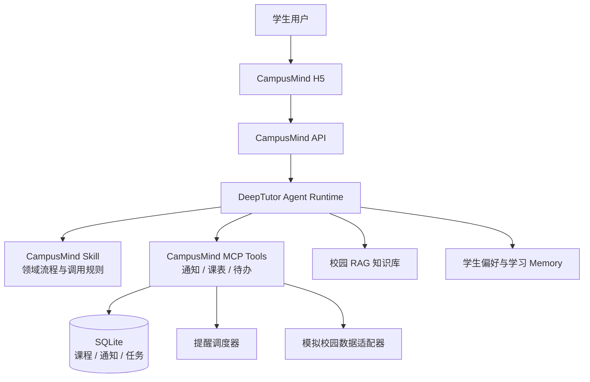

<div align="center">

# CampusMind AI

### 基于 Agent 的私人校园智能体

让 AI 不只回答校园问题，还能理解通知、整理事务、生成待办并主动提醒。

[](#项目状态)
[](https://github.com/HKUDS/DeepTutor)
[](#计划技术栈)

**Meoo 想天开 · AI 互动应用赛道参赛项目**

</div>

---

## 项目简介

高校里的课程、通知、报名、考试和活动信息通常分散在教务系统、学院网站、公众号与班级群中。学生不仅需要反复查找，还需要自己判断重点、记录截止时间并安排后续行动。

CampusMind AI 希望把这些零散信息变成一个可以执行的校园事务流：

```text
校园信息 → Agent 理解 → 结构化事项 → 待办与日程 → 主动提醒
```

项目基于开源 [DeepTutor](https://github.com/HKUDS/DeepTutor) 的 Agent、Tool、RAG 和 Memory 能力扩展校园领域功能。CampusMind 不重写 DeepTutor 核心，而是通过独立 Skill、MCP Tool 和校园数据层完成二次开发。

> CampusMind AI 不是另一个只会聊天的校园问答机器人，而是一个能够理解校园环境、记住学生特点并协助完成事务的校园智能体。

## 核心体验

### 1. 今日校园简报

用户询问“今天有什么事情？”，Agent 会汇总当天课程、临期待办、重要通知和风险提醒，而不是只返回一段泛化建议。

### 2. 通知转行动

系统将长篇校园通知解析为可执行事项：

```text
四六级报名通知
├─ 适用对象：2026 级本科生
├─ 截止时间：9 月 15 日 18:00
├─ 重要程度：高
├─ 下一步：登录教务系统完成报名
└─ 自动生成：报名待办 + 截止提醒
```

### 3. 课表与空闲时间

结合课程时间、地点和已有任务，回答“下一节课在哪里”“今晚有没有空”“什么时候适合完成实验报告”等问题。

### 4. 校园知识问答

通过校园规章、办事流程和通知文件构建 RAG 知识库，为答案提供可追溯依据。

### 5. 个性化主动提醒

依据年级、专业、课程和学习习惯调整提醒内容，例如在考试前生成阶段性复习建议，而不是发送固定模板。

## 系统架构



### 职责边界

| 模块 | 负责内容 | 不负责内容 |
| --- | --- | --- |
| CampusMind Skill | 告诉 Agent 何时、按什么流程处理校园事务 | 不直接保存任务或执行提醒 |
| MCP Tools | 通知解析、课程查询、待办创建与状态更新 | 不替代 Agent 的意图判断 |
| SQLite | 保存课程、通知、任务和准确截止时间 | 不保存模糊的长期偏好 |
| DeepTutor RAG | 检索规章、流程与通知原文 | 不充当事务数据库 |
| DeepTutor Memory | 保存专业、兴趣、习惯等个性化信息 | 不作为课表和截止时间的唯一来源 |
| Scheduler | 在确定时间触发提醒 | 不依赖用户主动发起聊天 |

## MVP 范围

首个可运行版本只验证一条完整链路：

```text
模拟校园通知与课表
        ↓
Agent 调用 CampusMind Tool
        ↓
生成结构化任务并写入 SQLite
        ↓
H5 展示今日简报
        ↓
触发临期提醒
```

MVP 包含：

- 模拟校园通知、课表和学生档案
- 通知关键信息提取与字段校验
- 今日课程查询与空闲时间计算
- 待办创建、完成和优先级排序
- 校园资料 RAG 问答
- 本地定时提醒
- 面向演示的响应式 H5 页面

MVP 暂不包含：

- 真实教务系统账号登录或自动操作
- 对所有高校系统的通用适配
- 小程序正式上架与消息审核流程
- 未经用户授权采集班级群或私人数据

## 计划技术栈

| 层级 | 技术选型 |
| --- | --- |
| Agent 运行时 | DeepTutor |
| 后端 | Python 3.12、FastAPI、Pydantic |
| Agent 扩展 | DeepTutor Skill、MCP Tools |
| 数据 | SQLite、模拟校园数据适配器 |
| 知识库 | DeepTutor RAG |
| 前端 | React、Vite、TypeScript |
| 测试 | Pytest、前端单元测试、浏览器流程测试 |

具体依赖将在首个可运行里程碑中锁定，README 不提前声明尚未验证的版本兼容性。

## 计划目录

> 以下为拟建结构，当前仓库尚处于项目初始化阶段。

```text
CampusMind-AI/
├─ apps/
│  ├─ api/                    # FastAPI 服务入口
│  └─ web/                    # CampusMind H5
├─ campusmind/
│  ├─ domain/                 # Notice、Course、Task 等领域模型
│  ├─ tools/                  # DeepTutor / MCP 工具
│  ├─ services/               # 通知、课表、待办、提醒服务
│  └─ storage/                # SQLite 仓储实现
├─ skills/
│  └─ campusmind/SKILL.md     # Agent 校园工作流
├─ data/demo/                 # 可公开的模拟演示数据
├─ tests/                     # 单元与集成测试
├─ docs/                      # 架构、演示和答辩材料
└─ README.md
```

## 多人协作执行方案

### 总体节奏

项目按 **1 名统筹 + 4 个开发角色** 并行推进：

| 时间 | 工作重点 | 范围规则 |
| --- | --- | --- |
| Day 1–4 | 完成功能、打通三条核心演示链路 | Day 4 18:00 功能冻结 |
| Day 5–8 | Debug、稳定性、UI、测试和演示改进 | 禁止新增非必要功能 |

前四天的目标不是“每个人完成自己的模块”，而是每天都合出一个可运行版本。后四天不再追求功能数量，只提高成功率、清晰度和现场演示质量。

### 最终验收目标

项目必须连续三次稳定完成以下场景：

1. 用户询问“今天有什么事情”，系统汇总课程、待办、通知和冲突。
2. 用户粘贴校园通知，系统提取关键信息、确认不确定字段并生成待办。
3. 用户询问校园规定，系统通过 RAG 回答并展示资料来源。
4. 临期事项可以产生提醒，任务完成后不再重复提醒。

此外还必须满足：

- 同一通知重复导入不会产生重复任务。
- 所有时间统一使用 `Asia/Shanghai`。
- 课程、任务和截止时间只能来自结构化数据，不能由模型编造。
- RAG 没有可靠资料时必须表示无法确认。
- 模型、数据库或网络异常时页面能结束加载并说明原因。
- 仓库中不出现真实学生隐私、校园密码和 API Key。
- Windows 新环境可以按照文档完成启动。

## 团队角色与责任

### 角色 0：项目统筹与集成

**目的**

保证 Agent、数据、校园服务和前端遵循同一套接口，避免每个人的模块单独可运行但无法组合。

**负责范围**

- 项目结构和技术决策
- 公共数据模型和 API 契约
- DeepTutor 版本与依赖锁定
- 分支、PR 和每日集成
- 测试清单、演示数据与发布版本
- Windows 启动说明、Demo 脚本和答辩材料

**主要维护文件**

```text
README.md
docs/architecture.md
docs/api-contract.md
docs/demo-script.md
docs/test-checklist.md
pyproject.toml
.env.example
.gitignore
```

**工作方法**

1. Day 1 上午冻结第一版模型和接口。
2. 每天上午确认前一天版本仍可运行。
3. 每天下午按 Data → Service → Agent → Web 的顺序集成。
4. 合并后运行自动测试和三个演示冒烟流程。
5. 公共字段发生变化时，同时更新契约、Mock、测试和所有调用方。

**交付物**

- 每日可运行版本
- API 和数据契约
- 集成问题记录
- 启动与发布文档
- 最终测试报告
- 演示脚本和备用录屏

**验收标准**

- `main` 始终保持可运行。
- 任一成员能根据文档启动自己负责的模块。
- 公共字段只有一个定义来源。
- 每个 PR 都写清输入、输出、测试和影响范围。

### 角色 1：DeepTutor 与 Agent 开发

**目的**

让 CampusMind 真实使用 Agent、Skill、Tool、RAG 和 Memory，而不是在页面中写死回答。

**负责目录**

```text
campusmind/integrations/deeptutor/
campusmind/tools/
skills/campusmind/
apps/api/agent/
tests/agent/
```

**功能要求**

- 安装并启动 DeepTutor。
- 创建 CampusMind Skill，定义校园请求的处理步骤。
- 注册并调用 CampusMind MCP Tools。
- 连接 RAG、Memory 和结构化校园数据。
- 保存 Tool 调用轨迹，便于 Debug 和答辩展示。
- 处理模型超时、工具失败和返回格式错误。

**第一批 Tool**

| Tool | 输入 | 输出 | 关键限制 |
| --- | --- | --- | --- |
| `get_today_brief` | 学生 ID、日期、时区 | 课程、任务、通知、冲突、建议 | 不得编造缺失数据 |
| `parse_notice` | 通知正文、学生 ID、参考时间 | 标题、对象、截止时间、行动、置信度 | 时间不确定时必须请求确认 |
| `create_task` | 标题、截止时间、来源、优先级 | 任务 ID、是否新建 | 必须通过 `dedupe_key` 去重 |
| `get_courses` | 学生 ID、日期 | 当天课程、下一节课 | 必须读取课程服务 |
| `complete_task` | 学生 ID、任务 ID | 最新任务状态 | 不允许只在回复中声称已完成 |

**Skill 编写方法**

Skill 只负责描述：

- 哪些请求需要校园 Tool。
- Tool 的调用顺序。
- 哪些字段必须向用户确认。
- 何时调用 RAG、何时读写 Memory。
- 哪些数据禁止模型自行推断。

Skill 不保存任务、不执行提醒，也不把课表硬编码进提示词。

**验收标准**

- “今天有什么事情”会真实调用 `get_today_brief`。
- 普通闲聊不会误调用校园 Tool。
- 工具失败后 Agent 不会继续编造成功结果。
- 通知年份或截止时间不明确时会请求用户确认。
- 调用轨迹能显示 Tool 名称、输入摘要、结果和耗时。

### 角色 2：数据与 RAG 开发

**目的**

为课程、通知、任务和校园规定建立可信来源，避免重要数据只存在模型上下文中。

**负责目录**

```text
campusmind/domain/
campusmind/storage/
campusmind/repositories/
data/demo/
data/knowledge/
tests/storage/
tests/rag/
```

**核心模型**

| 模型 | 必要字段 |
| --- | --- |
| `Notice` | id、title、raw_text、audience、deadline、actions、priority、source、confidence |
| `Course` | id、student_id、name、weekday、start_time、end_time、location、week_pattern |
| `Task` | id、student_id、title、status、priority、due_at、source_notice_id、dedupe_key |
| `StudentProfile` | id、major、grade、timezone、quiet_hours、reminder_preferences |
| `Reminder` | id、task_id、trigger_at、channel、status、sent_at、failure_reason |

**数据库要求**

- 使用 SQLite 并开启外键约束。
- 所有时间保存为带时区的 ISO 8601。
- `Task.dedupe_key` 建立唯一索引。
- 测试数据库、演示数据库和本地开发数据库分离。
- 数据库初始化可以重复执行。
- 仓库提交初始化脚本和演示数据，不提交包含个人数据的数据库文件。

**RAG 资料要求**

至少准备：

- 2 份教务规章
- 5 条校园通知
- 1 份四六级报名说明
- 1 份考试管理规定
- 1 份竞赛或奖学金说明

每份资料记录：

```text
source_id
title
source_type
published_at
effective_date
url 或本地文件路径
是否为模拟资料
```

**验收标准**

- 有资料的问题能引用正确来源。
- 无资料的问题不会使用模型常识假装来自学校规定。
- 同一份通知重复导入不会产生重复记录。
- 文档更新后可以重新索引。
- 模拟资料在页面和数据中有明确标识。

### 角色 3：校园功能开发

**目的**

把校园数据转化为稳定、可测试的业务规则，而不是把全部判断交给大模型。

**负责目录**

```text
campusmind/services/notice/
campusmind/services/course/
campusmind/services/task/
campusmind/services/reminder/
tests/services/
```

**通知处理方法**

```text
原始通知
→ 模型提取候选字段
→ Pydantic 校验
→ 日期和时区标准化
→ 检查适用对象
→ 计算置信度
→ 用户确认或生成任务
```

必须处理：

- “本周五”等相对时间。
- 通知缺少年份。
- 同时出现报名开始和截止时间。
- 一条通知包含多个行动事项。
- 通知已经过期。
- 通知不适用于当前学生。
- 同一通知被重复导入。

**课表功能要求**

- 查询今日课程和下一节课程。
- 支持单双周或指定周次。
- 计算可用空闲时间。
- 检测课程、考试和待办之间的冲突。
- 无课程和地点缺失时返回明确状态。

**待办优先级规则**

| 条件 | 默认优先级 |
| --- | --- |
| 已逾期或不可补办 | `critical` |
| 24 小时内截止 | `high` |
| 3 天内截止 | `medium` |
| 超过 3 天 | `normal` |

模型可以解释优先级，但不能绕过规则直接修改结果。

**默认提醒规则**

| 事项 | 默认提醒时间 |
| --- | --- |
| 报名截止 | 7 天、3 天、1 天、3 小时前 |
| 考试 | 7 天、3 天、1 天前 |
| 作业 | 3 天、1 天、3 小时前 |
| 课程 | 30 分钟前 |
| 普通活动 | 1 天、2 小时前 |

还必须处理勿扰时段、已完成任务、重复提醒、系统重启和发送失败重试。

**验收标准**

- 20 条通知样本能完成字段校验。
- 10 组课表查询结果正确。
- 5 组时间冲突能被识别。
- 5 种重复任务不会重复入库。
- 已完成任务不会继续提醒。

### 角色 4：前端与演示开发

**目的**

把 Agent 的工作过程变成用户能理解、评委能看懂、现场能稳定操作的 H5。

**负责目录**

```text
apps/web/src/pages/
apps/web/src/components/
apps/web/src/api/
apps/web/src/mocks/
apps/web/src/types/
apps/web/tests/
```

**页面要求**

| 页面 | 必须展示 |
| --- | --- |
| 今日简报 | 下一节课、今日任务、高优先级事项、通知和 Agent 建议 |
| 通知解析 | 原文、提取字段、置信度、来源、人工确认、创建任务 |
| 课表 | 今日课程、下一节课、空闲时间和冲突提示 |
| 待办 | 日期分组、优先级、完成状态、来源通知和提醒时间 |
| Chat | 流式回复、Tool 状态、RAG 来源、错误和重试 |

**并行开发方法**

Day 1 不等待后端，先建立：

```text
apps/web/src/mocks/today-brief.json
apps/web/src/mocks/notice-result.json
apps/web/src/mocks/tasks.json
```

接口稳定后只替换 `api/` 层，页面组件不跟随后端反复重写。

**UI 状态要求**

- Loading
- Empty
- Error
- Partial data
- Long text
- Offline / timeout
- Tool running / success / failure
- Mobile navigation

**验收尺寸**

- 手机：`375 × 812`
- 笔记本：`1366 × 768`
- 演示屏：`1440 × 900`

## 目录所有权

| 目录 | 主要负责人 | 修改规则 |
| --- | --- | --- |
| `skills/campusmind/` | Agent | 其他人修改前先确认调用逻辑 |
| `campusmind/integrations/` | Agent | Lead 审核 |
| `campusmind/domain/` | Data | 公共字段变更必须全员同步 |
| `campusmind/storage/` | Data | Service 通过 Repository 调用 |
| `campusmind/services/` | Service | Data 和 Agent 不直接写业务规则 |
| `apps/web/` | Web | 后端通过接口提供数据，不直接改页面 |
| `data/demo/` | Data | Web 提需求，不自行改变字段结构 |
| `docs/` | Lead | 各角色提供内容，Lead 统一整理 |
| 根目录配置 | Lead | 单独提交并说明影响范围 |

## 接口协作方法

### HTTP 接口

```text
GET   /api/health
GET   /api/v1/brief/today
POST  /api/v1/notices/parse
GET   /api/v1/courses/today
POST  /api/v1/tasks
GET   /api/v1/tasks
PATCH /api/v1/tasks/{task_id}
GET   /api/v1/reminders/due
POST  /api/v1/chat
```

### 统一响应格式

成功：

```json
{
  "ok": true,
  "data": {},
  "error": null,
  "request_id": "req-001"
}
```

失败：

```json
{
  "ok": false,
  "data": null,
  "error": {
    "code": "NOTICE_DATE_AMBIGUOUS",
    "message": "无法确认通知中的年份",
    "details": {}
  },
  "request_id": "req-001"
}
```

前端只能根据稳定的 `error.code` 判断业务状态，不能解析错误文字。

### 接口变更流程

1. 写出旧结构、新结构和修改原因。
2. 标明受影响的角色和文件。
3. 先更新契约、类型、Mock 和测试。
4. 再修改后端实现。
5. 当天迁移所有调用方，不长期保留两套字段。

## Git 协作规则

### 分支建议

```text
main
├─ feat/agent-runtime
├─ feat/data-rag
├─ feat/campus-services
├─ feat/web-dashboard
└─ docs/project-plan
```

- 禁止直接向 `main` 推送开发代码。
- 一个分支只负责一个清晰目标。
- 公共配置修改使用独立 PR。
- 每天至少推送一次可审查的进度。

### Commit 示例

```text
feat(agent): register campus MCP tools
feat(notice): validate ambiguous deadlines
feat(web): add today brief page
test(task): cover duplicate notice imports
fix(reminder): skip completed tasks
docs: define API error codes
```

### PR 必填内容

```text
目标：
改了什么：
没有改什么：
输入：
输出：
测试方法：
界面截图：
依赖哪个 PR：
影响哪些模块：
```

- 普通 PR 尽量控制在 400 行有效代码以内。
- 大功能拆成模型、服务、接口和页面四部分。
- 一次 PR 不同时大改数据库、Agent 和前端。
- 合并前至少由一名非作者成员实际运行。

## 8 天详细开发计划

### Day 1：统一基线与最小可运行版本

**当天目标：** 建立项目骨架，让页面通过 Mock/Fake Tool 展示“今日简报”。

| 角色 | 当天任务 |
| --- | --- |
| Lead | 建目录、Python 3.12 环境、分支规则、第一版接口契约 |
| Agent | 启动 DeepTutor，注册一个测试 Tool，输出调用日志 |
| Data | 建立五个核心 Pydantic 模型和 SQLite 初始化 |
| Service | 定义通知、课表、待办、提醒 Service 接口 |
| Web | 建立 Vite H5，使用 Mock 展示今日简报 |

**完成标准：** 页面可以展示课程、待办和通知；Agent 能成功调用一个测试 Tool；所有人使用同一套字段。

### Day 2：真实数据与今日简报

**当天目标：** 将前端 Mock 替换为 SQLite 和真实服务数据。

| 角色 | 当天任务 |
| --- | --- |
| Lead | 集成 Data、Service、Agent 和 Web，建立冒烟测试 |
| Agent | 实现 `get_today_brief`，连接校园服务 |
| Data | 完成课程、任务、通知表和演示数据导入 |
| Service | 完成今日课程、任务排序和冲突查询 |
| Web | 接入真实今日简报，补 Loading、Empty、Error |

**完成标准：** “今天有什么事情”返回 SQLite 中的真实演示数据，前端不再依赖今日简报 Mock。

### Day 3：通知转任务与 RAG

**当天目标：** 跑通“通知 → 字段提取 → 用户确认 → 待办入库”，并完成一个有引用的校园问答。

| 角色 | 当天任务 |
| --- | --- |
| Lead | 固定通知和错误码契约，检查重复导入 |
| Agent | 接入 `parse_notice`、`create_task` 和 RAG |
| Data | 保存通知原文和来源，建立知识库索引 |
| Service | 完成日期标准化、适用对象、置信度和去重 |
| Web | 完成通知解析页、确认字段和 RAG 来源展示 |

**完成标准：** 一条四六级通知生成一条不重复任务；一个校园问题能显示正确资料来源。

### Day 4：课表、提醒、Memory 与功能冻结

**当天目标：** 补齐核心功能，18:00 后冻结功能范围。

| 角色 | 当天任务 |
| --- | --- |
| Lead | 完成全链路集成，建立功能冻结清单 |
| Agent | 接入课表 Tool、任务完成 Tool 和学生偏好 Memory |
| Data | 完善课表周次、提醒状态和学生画像数据 |
| Service | 完成空闲时间、冲突检测、提醒计算和去重 |
| Web | 完成课表、待办、提醒和 Chat 基础页面 |

**完成标准：** 今日简报、通知转任务、校园问答、课表和提醒均有可操作版本。Day 4 18:00 后不得增加新页面和新核心功能。

### Day 5：全链路 Debug 与错误状态 UI

**当天目标：** 找出所有必现错误，保证失败时系统能正常结束和解释。

| 角色 | 当天任务 |
| --- | --- |
| Lead | 组织三轮全链路测试，按严重程度分配 Bug |
| Agent | 修复误调用、重复调用、模型超时和工具失败 |
| Data | 修复迁移、空数据库、重复数据和索引问题 |
| Service | 修复模糊时间、过期通知、冲突和重复提醒 |
| Web | 完善 Loading、Empty、Error、Retry 和 Partial data |

**重点测试：** API Key 缺失、模型超时、RAG 无结果、数据库为空、重复导入、无效日期和超长通知。

**完成标准：** 所有 P0/P1 Bug 有负责人；失败场景不无限加载、不白屏、不伪造成功结果。

### Day 6：稳定性 Debug 与响应式 UI

**当天目标：** 提高长时间运行和不同屏幕下的稳定性。

| 角色 | 当天任务 |
| --- | --- |
| Lead | 运行回归测试，检查 Windows 全新启动流程 |
| Agent | 修复上下文污染、Memory 误写和流式中断 |
| Data | 检查多学生隔离、数据库重启和重新索引 |
| Service | 修复时区、勿扰时段、重启恢复和提醒重试 |
| Web | 优化手机、笔记本和演示屏布局，处理长文本 |

**UI 检查：** `375 × 812`、`1366 × 768`、`1440 × 900`，同时检查键盘操作、滚动、遮挡和按钮重复点击。

**完成标准：** 三种尺寸可操作；服务重启后数据和提醒状态正确恢复。

### Day 7：回归测试、性能和视觉打磨

**当天目标：** 不再修改架构，只修影响体验和演示的问题。

| 角色 | 当天任务 |
| --- | --- |
| Lead | 完整回归、更新测试清单、确认剩余风险 |
| Agent | 缩短无效 Tool 调用，优化响应和错误提示 |
| Data | 检查 RAG 引用、过期资料和数据一致性 |
| Service | 优化查询和提醒任务，补齐边界测试 |
| Web | 统一颜色、间距、字体、动画、卡片和状态反馈 |

**UI 改进重点：**

- 第一屏突出下一节课和最高优先级任务。
- Agent 正在做什么必须可见，但不展示冗长技术日志。
- 通知原文、解析结果和创建任务之间形成清晰步骤。
- 高优先级、逾期和普通事项有稳定的视觉区分。
- 动画只用于状态变化，不能拖慢操作。

**完成标准：** 三个演示场景连续运行三次；没有未处理的 P0/P1 Bug。

### Day 8：最终 Debug、演示和发布

**当天目标：** 冻结代码，只处理阻止发布或演示的问题。

| 角色 | 当天任务 |
| --- | --- |
| Lead | 冻结版本、发布标签、安装验证、演示彩排 |
| Agent | 准备 Tool 调用轨迹和 Agent 能力说明 |
| Data | 准备数据来源、RAG 和隐私说明 |
| Service | 准备通知、任务和提醒规则说明 |
| Web | 完成截图、录屏、演示模式和最后视觉检查 |

**最终交付：**

- 可运行版本
- Windows 启动说明
- 自动与人工测试记录
- Demo 视频和备用录屏
- PPT 与答辩脚本
- 三个固定演示场景
- 已知限制清单

**完成标准：** 新环境可启动，三个场景可重复演示，现场断网或模型异常时有备用方案。

## Debug 优先级

| 级别 | 定义 | 处理规则 |
| --- | --- | --- |
| P0 | 无法启动、数据损坏、核心场景完全不可用 | 立即停止其他工作修复 |
| P1 | 核心结果错误、重复任务、提醒错误、隐私风险 | 当天修复并回归 |
| P2 | 局部交互错误、错误提示不清、特定尺寸异常 | Day 5–7 修复 |
| P3 | 轻微样式、措辞和不影响演示的问题 | 有余量再处理 |

每个 Bug 必须记录：复现步骤、预期结果、实际结果、环境、日志、严重程度、负责人和回归结果。

## 测试清单

### Agent

- 是否调用正确 Tool。
- 是否发生重复调用。
- 工具失败后是否继续编造。
- 不确定信息是否请求用户确认。
- Tool 调用轨迹是否可读。

### 通知

- 无年份、相对日期、多个截止时间。
- 已过期、不适用当前学生、重复导入。
- 空文本、超长文本和格式混乱文本。

### 课表与待办

- 当天无课、单双周、课程冲突、地点缺失。
- 重复创建、逾期、完成后恢复、截止时间变化。
- 不同学生之间的数据隔离。

### RAG

- 有答案、无答案、资料冲突、资料过期。
- 引用来源是否正确并可访问。

### 前端

- 网络断开、接口超时、空列表和长标题。
- 快速重复点击、流式回复中断和页面刷新。
- 手机窄屏、笔记本和演示屏。

## 完成定义

一项任务同时满足以下条件才算完成：

- 功能代码已提交。
- 有自动测试或明确人工验证步骤。
- 正常、空数据和异常路径均已处理。
- 没有写死真实账号、隐私和密钥。
- 对外接口与契约一致。
- 必要文档已更新。
- 至少一名非作者成员实际运行过。
- 已合入当日集成版本。

“我这里可以运行”不等于完成。

## 项目状态

当前状态：**MVP 建设前的架构与协作方案整理阶段**。

- [x] 明确产品定位与核心场景
- [x] 确认基于 DeepTutor 扩展而非重写核心
- [x] 明确 Skill、Tool、RAG、Memory 与结构化数据的边界
- [x] 制定多人分工、目录所有权和 8 天执行计划
- [ ] 建立可运行的后端和测试基线
- [ ] 完成“今日校园简报”纵向链路
- [ ] Day 4 完成功能冻结
- [ ] Day 5–8 完成 Debug 和 UI 改进

在代码真正落地并通过验证前，本 README 中的功能均视为设计目标，不代表已经交付。

## 上游项目与许可

CampusMind AI 使用 [HKUDS/DeepTutor](https://github.com/HKUDS/DeepTutor) 作为上游技术基础。DeepTutor 采用 Apache License 2.0，使用和分发时应保留相应版权及许可声明。

CampusMind AI 自身的仓库许可将在首个可运行版本发布前确认并补充；仓库内第三方组件分别遵循其原始许可。

---

<div align="center">

**CampusMind AI — 让校园信息被理解，让学生事务被完成。**

</div>
